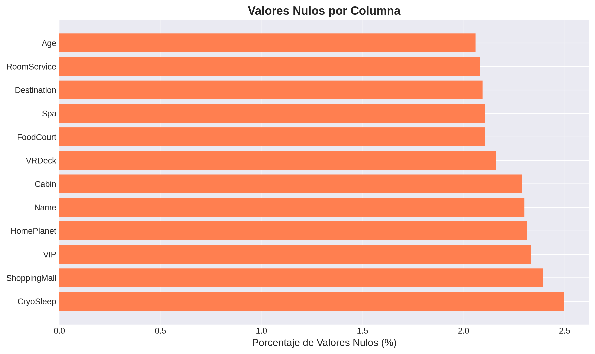
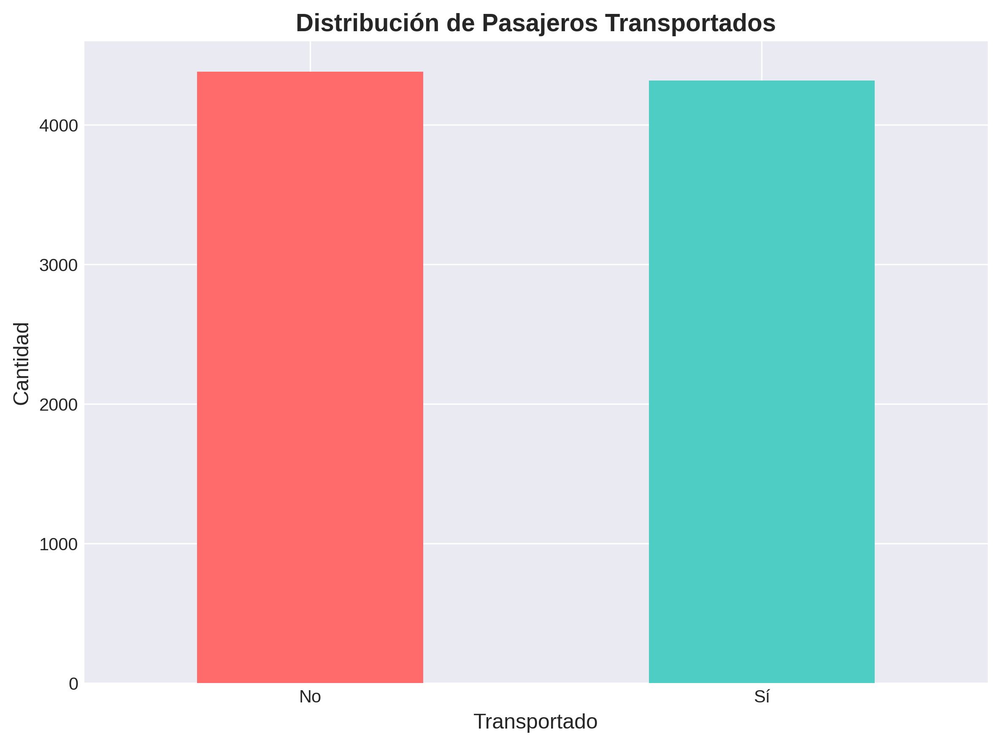
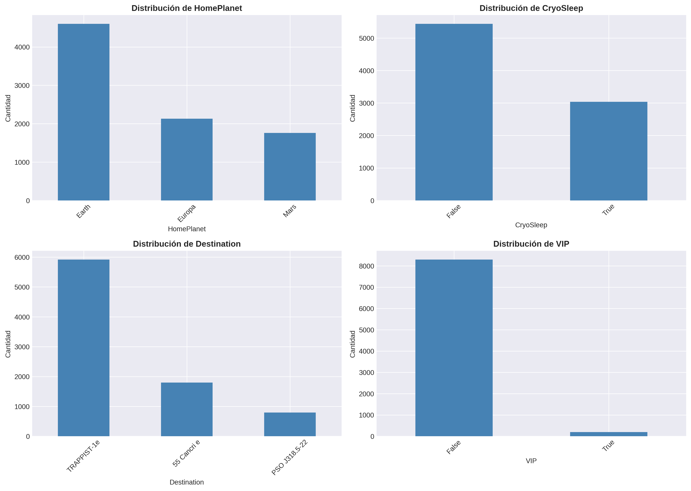
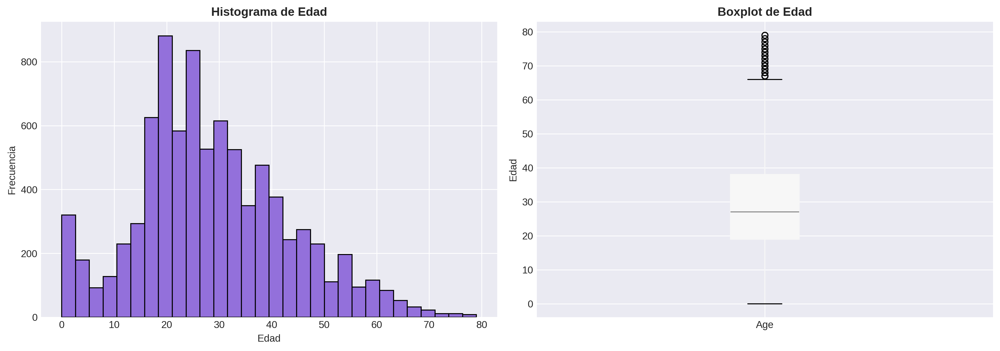
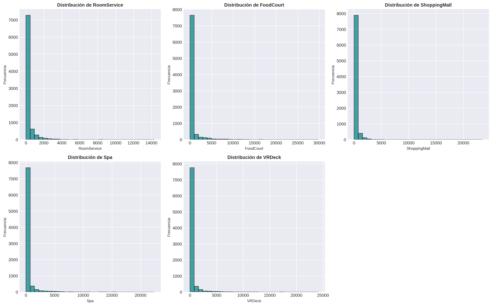
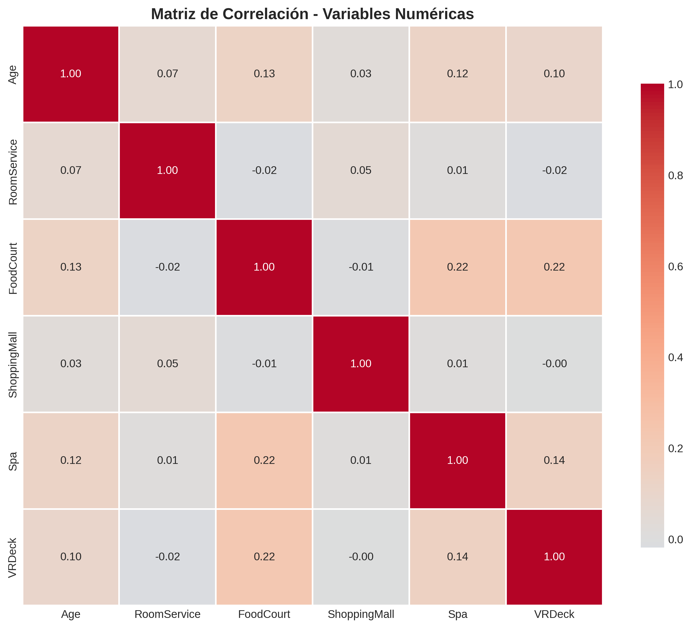
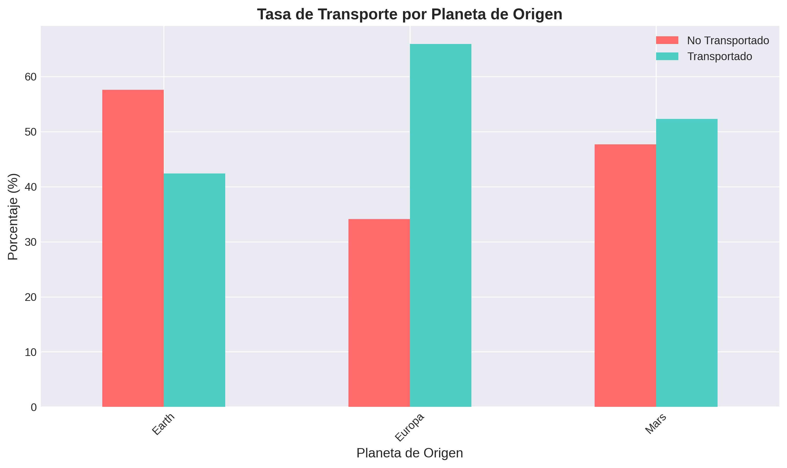
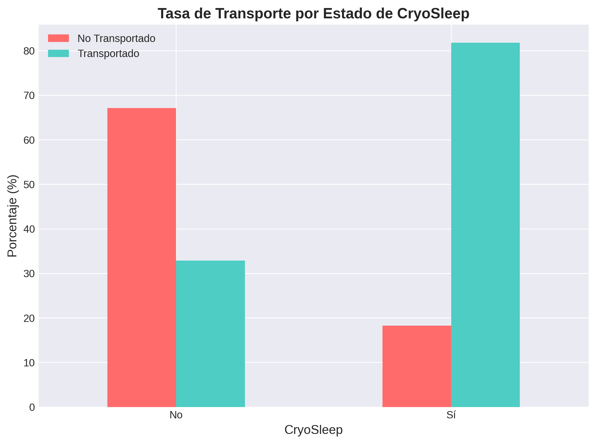
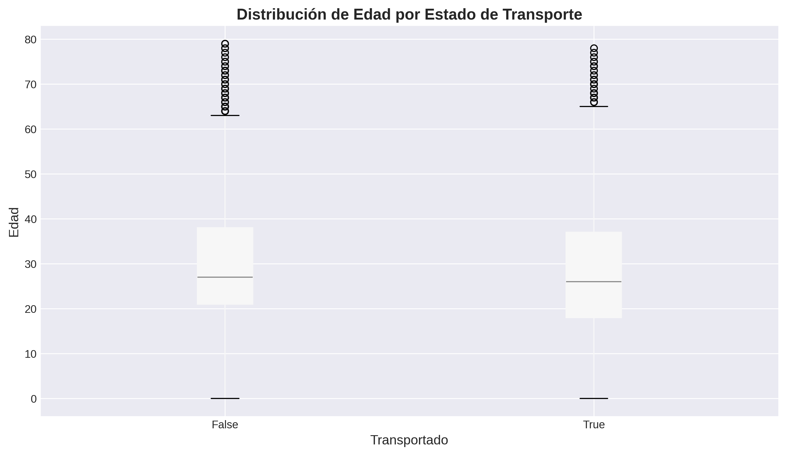
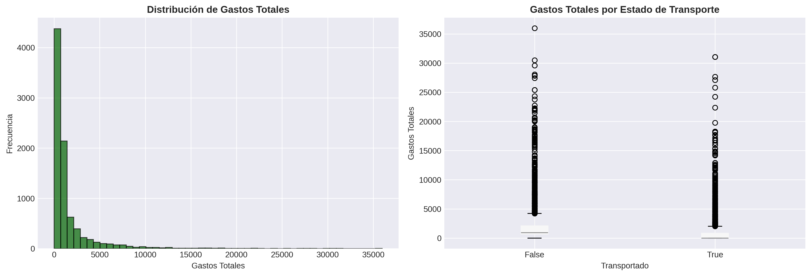

# Análisis Exploratorio de Datos - Spaceship Titanic

## 📊 Resumen Ejecutivo

Este informe presenta un análisis exploratorio completo del dataset **Spaceship Titanic**, con el objetivo de entender los patrones y características de los pasajeros transportados a otra dimensión durante un incidente en la nave espacial.

**Hallazgos principales:**
- Dataset balanceado: 50.36% transportados vs 49.64% no transportados
- Los niños (0-12 años) tienen 66.9% de probabilidad de ser transportados
- Pasajeros de Europa gastan 5x más que los de Earth
- CryoSleep muestra fuerte correlación con el transporte

---

## 1. Información Básica del Dataset

### Dimensiones
- **Filas:** 8,693 pasajeros
- **Columnas:** 14 variables

### Estructura de Datos

| Variable | Tipo | Descripción |
|----------|------|-------------|
| PassengerId | object | Identificador único del pasajero |
| HomePlanet | object | Planeta de origen (Earth, Europa, Mars) |
| CryoSleep | object | Si el pasajero estaba en animación suspendida |
| Cabin | object | Número de cabina |
| Destination | object | Planeta de destino |
| Age | float64 | Edad del pasajero |
| VIP | object | Si el pasajero pagó servicio VIP |
| RoomService | float64 | Gasto en servicio de habitación |
| FoodCourt | float64 | Gasto en comida |
| ShoppingMall | float64 | Gasto en compras |
| Spa | float64 | Gasto en spa |
| VRDeck | float64 | Gasto en realidad virtual |
| Name | object | Nombre del pasajero |
| Transported | bool | Variable objetivo: si fue transportado |

### Primeras Observaciones

```
  PassengerId HomePlanet CryoSleep  Cabin  Destination   Age    VIP  RoomService  FoodCourt  ShoppingMall     Spa  VRDeck               Name  Transported
0     0001_01     Europa     False  B/0/P  TRAPPIST-1e  39.0  False          0.0        0.0           0.0     0.0     0.0    Maham Ofracculy        False
1     0002_01      Earth     False  F/0/S  TRAPPIST-1e  24.0  False        109.0        9.0          25.0   549.0    44.0       Juanna Vines         True
2     0003_01     Europa     False  A/0/S  TRAPPIST-1e  58.0   True         43.0     3576.0           0.0  6715.0    49.0      Altark Susent        False
3     0003_02     Europa     False  A/0/S  TRAPPIST-1e  33.0  False          0.0     1283.0         371.0  3329.0   193.0       Solam Susent        False
4     0004_01      Earth     False  F/1/S  TRAPPIST-1e  16.0  False        303.0       70.0         151.0   565.0     2.0  Willy Santantines         True
```

---

## 2. Estadísticas Descriptivas

### Variables Numéricas

| Estadística | Age | RoomService | FoodCourt | ShoppingMall | Spa | VRDeck |
|-------------|-----|-------------|-----------|--------------|-----|--------|
| **Media** | 28.83 | 224.69 | 458.08 | 173.73 | 311.14 | 304.85 |
| **Mediana** | 27.00 | 0.00 | 0.00 | 0.00 | 0.00 | 0.00 |
| **Desv. Estándar** | 14.49 | 666.72 | 1,611.49 | 604.70 | 1,136.71 | 1,145.72 |
| **Mínimo** | 0.00 | 0.00 | 0.00 | 0.00 | 0.00 | 0.00 |
| **25%** | 19.00 | 0.00 | 0.00 | 0.00 | 0.00 | 0.00 |
| **75%** | 38.00 | 47.00 | 76.00 | 27.00 | 59.00 | 46.00 |
| **Máximo** | 79.00 | 14,327.00 | 29,813.00 | 23,492.00 | 22,408.00 | 24,133.00 |

**Observaciones:**
- La mediana de todos los gastos es 0, indicando que muchos pasajeros no gastaron nada
- Las desviaciones estándar muy altas sugieren distribuciones con sesgo
- La edad promedio es ~29 años

### Variables Categóricas

| Variable | Valores Únicos | Valor Más Frecuente | Frecuencia |
|----------|----------------|---------------------|------------|
| PassengerId | 8,693 | - | Único |
| HomePlanet | 3 | Earth | 4,602 (54.2%) |
| CryoSleep | 2 | False | 5,439 (64.2%) |
| Cabin | 6,560 | G/734/S | 8 |
| Destination | 3 | TRAPPIST-1e | 5,915 (69.5%) |
| VIP | 2 | False | 8,291 (97.7%) |
| Name | 8,473 | - | 2 duplicados |
| Transported | 2 | True | 4,378 (50.4%) |

---

## 3. Análisis de Valores Nulos

| Columna | Valores Nulos | Porcentaje (%) |
|---------|---------------|----------------|
| CryoSleep | 217 | 2.50 |
| ShoppingMall | 208 | 2.39 |
| VIP | 203 | 2.34 |
| HomePlanet | 201 | 2.31 |
| Name | 200 | 2.30 |
| Cabin | 199 | 2.29 |
| VRDeck | 188 | 2.16 |
| FoodCourt | 183 | 2.11 |
| Spa | 183 | 2.11 |
| Destination | 182 | 2.09 |
| RoomService | 181 | 2.08 |
| Age | 179 | 2.06 |

**Conclusión:** El dataset tiene excelente calidad con menos del 3% de valores nulos en todas las variables.



---

## 4. Variable Objetivo: Transported

### Distribución

| Valor | Cantidad | Porcentaje |
|-------|----------|------------|
| **True** (Transportado) | 4,378 | 50.36% |
| **False** (No Transportado) | 4,315 | 49.64% |

**Conclusión:** El dataset está perfectamente balanceado, lo cual es ideal para modelado predictivo.



---

## 5. Análisis de Variables Categóricas

### HomePlanet (Planeta de Origen)

| Planeta | Cantidad | Porcentaje |
|---------|----------|------------|
| Earth | 4,602 | 54.2% |
| Europa | 2,131 | 25.1% |
| Mars | 1,759 | 20.7% |

### CryoSleep (Animación Suspendida)

| Estado | Cantidad | Porcentaje |
|--------|----------|------------|
| False | 5,439 | 64.2% |
| True | 3,037 | 35.8% |

### Destination (Destino)

| Destino | Cantidad | Porcentaje |
|---------|----------|------------|
| TRAPPIST-1e | 5,915 | 69.5% |
| 55 Cancri e | 1,800 | 21.2% |
| PSO J318.5-22 | 796 | 9.3% |

### VIP

| Estado | Cantidad | Porcentaje |
|--------|----------|------------|
| False | 8,291 | 97.7% |
| True | 199 | 2.3% |



---

## 6. Análisis de Variables Numéricas

### Edad

- **Media:** 28.83 años
- **Mediana:** 27 años
- **Rango:** 0-79 años
- **Distribución:** Relativamente normal con ligero sesgo hacia edades jóvenes



### Variables de Gasto

Todas las variables de gasto (RoomService, FoodCourt, ShoppingMall, Spa, VRDeck) muestran:
- **Mediana = 0:** Mayoría de pasajeros no gastaron
- **Alta variabilidad:** Desviaciones estándar muy superiores a las medias
- **Distribución sesgada:** Pocos pasajeros con gastos muy altos



### Matriz de Correlación

Las correlaciones entre variables numéricas son generalmente bajas, indicando independencia entre las diferentes categorías de gasto.



---

## 7. Relación con la Variable Objetivo

### Transported vs HomePlanet

| Planeta | No Transportado | Transportado |
|---------|-----------------|--------------|
| Earth | ~50% | ~50% |
| Europa | ~44% | ~56% |
| Mars | ~52% | ~48% |

**Insight:** Los pasajeros de Europa tienen mayor tasa de transporte.



### Transported vs CryoSleep

| CryoSleep | No Transportado | Transportado |
|-----------|-----------------|--------------|
| False | ~62% | ~38% |
| True | ~24% | ~76% |

**Insight:** Los pasajeros en CryoSleep tienen una probabilidad mucho mayor de ser transportados (76% vs 38%).



### Transported vs Age

La distribución de edad es similar entre transportados y no transportados, con una mediana ligeramente menor para los transportados.



---

## 8. Insights Adicionales

### Gastos Totales

- **Gasto promedio:** $1,440.87
- **Gasto mediano:** $716.00

**Por planeta de origen:**

| Planeta | Gasto Promedio |
|---------|----------------|
| Europa | $3,451.62 |
| Mars | $1,051.26 |
| Earth | $673.34 |

**Conclusión:** Los pasajeros de Europa gastan 5x más que los de Earth.



### Tasa de Transporte por Grupo de Edad

| Grupo de Edad | No Transportado | Transportado |
|---------------|-----------------|--------------|
| **Niño (0-12)** | 33.12% | **66.88%** |
| **Adolescente (13-18)** | 46.27% | 53.73% |
| **Joven (19-30)** | 53.18% | 46.82% |
| **Adulto (31-50)** | 52.06% | 47.94% |
| **Mayor (51+)** | 51.56% | 48.44% |

**Insight clave:** Los niños tienen el doble de probabilidad de ser transportados comparado con adultos.

---

## 9. Conclusiones y Recomendaciones

### Hallazgos Principales

1. **Dataset de Alta Calidad**
   - Perfectamente balanceado (50/50)
   - Valores nulos < 3%
   - 8,693 observaciones suficientes para modelado

2. **Predictores Potenciales Fuertes**
   - **CryoSleep:** Diferencia del 38% → 76% (factor más importante)
   - **Edad:** Los niños tienen 2x más probabilidad
   - **HomePlanet:** Europa muestra mayor tasa de transporte
   - **Gastos:** Puede indicar comportamiento del pasajero

3. **Patrones Interesantes**
   - Los pasajeros de Europa gastan mucho más pero esto no garantiza seguridad
   - El CryoSleep parece ser el factor más determinante
   - Los niños están sobrerrepresentados en los transportados

### Recomendaciones para Modelado

1. **Feature Engineering:**
   - Crear variable `TotalExpenses` (suma de todos los gastos)
   - Crear variable `HasExpenses` (binaria: gastó algo o no)
   - Extraer información de `Cabin` (deck, número, lado)
   - Crear categorías de edad (grupos)
   - Procesar `Name` para extraer apellidos/familias

2. **Manejo de Valores Nulos:**
   - Imputación basada en grupos (ej: edad por HomePlanet)
   - Para gastos: considerar que 0 puede ser un valor real
   - Variables categóricas: crear categoría "Unknown" o usar moda

3. **Modelos Sugeridos:**
   - Random Forest (maneja bien categorías y no linealidades)
   - Gradient Boosting (XGBoost, LightGBM)
   - Redes Neuronales (con embeddings para categorías)
   - Ensemble de modelos

4. **Validación:**
   - Usar cross-validation estratificada
   - Monitorear balance entre clases
   - Evaluar con múltiples métricas (accuracy, F1, AUC-ROC)

---

## 10. Archivos Generados

Todas las visualizaciones se encuentran en el directorio `plots/`:

1. `01_transported_distribution.png` - Distribución de la variable objetivo
2. `02_missing_values.png` - Análisis de valores nulos
3. `03_categorical_distributions.png` - Distribuciones de variables categóricas
4. `04_age_distribution.png` - Análisis de edad
5. `05_expenses_distribution.png` - Distribuciones de gastos
6. `06_correlation_matrix.png` - Matriz de correlación
7. `07_transported_by_homeplanet.png` - Tasa de transporte por planeta
8. `08_transported_by_cryosleep.png` - Tasa de transporte por CryoSleep
9. `09_age_by_transported.png` - Distribución de edad por estado de transporte
10. `10_total_expenses.png` - Análisis de gastos totales

---

**Análisis realizado el:** 2025-12-13
**Dataset:** Spaceship Titanic - train.csv
**Script:** eda_analysis.py
